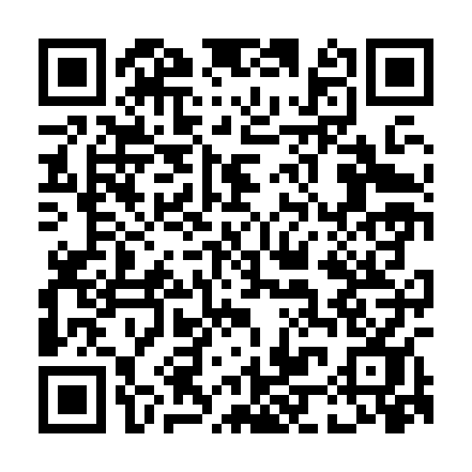

# ❤️U Festival App

Dit is de officiële mobiele webapplicatie (PWA) voor het **❤️U Festival**, speciaal ontwikkeld voor (nieuwe) studenten in de regio Utrecht als aanvulling op de Utrechtse Introductie Tijd (UIT). 

Met deze applicatie hebben festivalbezoekers alle benodigde informatie en interactieve hulpmiddelen direct in hun broekzak!

---

## 🚀 Wat de App kan & doet (Features)

De app biedt een breed scala aan functionaliteiten om de festivalervaring te optimaliseren:

### 1. 📅 Dynamisch Programma
*   **Volledig Rooster:** Bekijk het programma voor zowel **Zaterdag 5 september** als **Zondag 6 september 2026**.
*   **Live Act & DJ Set Indicators:** Duidelijk kleuronderscheid tussen live optredens (rood) en DJ-sets (blauw).
*   **Programma Nu (Live Indicator):** De homepage toont direct welke acts op dit moment live bezig zijn of welke act als volgende gepland staat.
*   **Artiest Popups:** Klik op een artiest om een detailvenster te openen met biografie, details en een geïntegreerde **YouTube-video/trailer**.

### 2. 🗺️ Interactieve Plattegrond
*   **Custom Pinch & Pan Engine:** Versleep en zoom soepel in op de festivalplattegrond met touch-gebaren (pinch-to-zoom) of het muiswiel.
*   **Marker Popups:** Klik op podia (Poton, The Lake, The Club, Hanggar) of servicepunten (EHBO, Bar, Lockers, Toiletten, Merchandise) om direct te zien wat er gebeurt of waar de faciliteit voor dient.
*   **Spraakgestuurd Zoeken (Voice Search):** Klik op het microfoon-icoontje en spreek een podium of service in (bijvoorbeeld *"Bar"* of *"Hanggar"*) om direct de markers op de kaart te filteren.
*   **Live GPS Mocking:** Volg je eigen locatie op de festivalplattegrond met de "Mijn Locatie"-knop en live GPS tracking.

### 3. ⭐ Favorietensysteem
*   **Artiesten Bewaren:** Klik op het hartje bij een artiest om deze toe te voegen aan je favorieten.
*   **Snelle Toegang:** Je favorieten worden direct getoond op de homepage en zijn eenvoudig in te zien via de plattegrond, zodat je jouw favoriete optredens nooit mist. De favorieten worden lokaal opgeslagen via `localStorage`.

### 4. ☀️ Live Weersinformatie
*   **Locatie-gebaseerd Weer:** De homepage haalt via de **Open-Meteo API** het live weer op voor de huidige GPS-locatie van de gebruiker.
*   **Kledingadvies:** De app geeft automatisch festival-kledingadvies op basis van de huidige temperatuur (bijv. *"Perfect festivalweer!"* of *"Fris — neem een trui mee."*).

### 5. 🌐 Meertaligheid (NL / EN)
*   **Taalswitcher:** Schakel in de header eenvoudig tussen Nederlands en Engels met de vlaggetjes-indicator.
*   **Dynamische Vertaling:** De gehele interface (inclusief dynamisch geladen weersinformatie en popups) wordt direct vertaald zonder de pagina te herladen.

### 6. 🌙 Dark Mode / Light Mode
*   **Thema Toggle:** Switch eenvoudig tussen een lichte interface en een energiebesparende, rustige dark mode voor in de avonduren.

---

## 🛠️ Technische Stack

*   **PHP:** Gebruikt voor modulaire server-side HTML-templating (`header.php`, `footer.php`).
*   **Vanilla CSS:** Volledig op maat gemaakte styling met een modern CSS-variabelen-systeem voor theming.
*   **Vanilla Javascript (ES6 Modules):** Schone, modulaire scripts voor alle interactieve elementen (pan-zoom, spraakherkenning, geolocatie, api-koppelingen).
*   **Open-Meteo API:** Voor real-time weersvoorspellingen.

---

## 📲 Scannen & Openen (QR-code)

Scan deze QR-code met je mobiele telefoon om de app direct te openen (zorg ervoor dat je telefoon verbonden is met hetzelfde wifi-netwerk):

*   **Live IP-adres:** `https://u240496.gluwebsite.nl/love-u-festival/pwa/`

